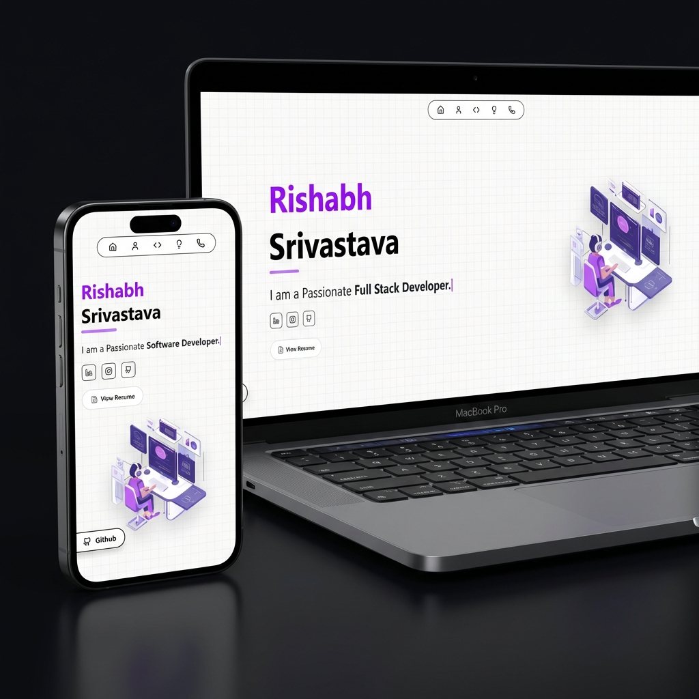

<div align="center">

# Rishabh's Portfolio - v2.0

### **[🔴 Live Demo](https://rishabh-portfoliopro.vercel.app/)**



A modern, high-performance portfolio website built with **Next.js**, **TypeScript**, and **Tailwind CSS**. Designed to showcase my skills, projects, and professional journey with smooth animations and a premium UI.

</div>

## 🚀 Tech Stack

<div align="center">

| Core | Styling | Motion | Tools |
| :---: | :---: | :---: | :---: |
|  |  |  |  |
| **App Router** | **CSS Modules** | **Animations** | **Type Safety** |

</div>

<br />

## ✨ Features

| Feature | Description |
| :--- | :--- |
| 📱 **Responsive** | Fully responsive design ensuring perfect rendering on Mobile, Tablet, and Desktop. |
| 🎨 **UI/UX** | Premium aesthetic with Dark Mode, Glassmorphism, and smooth transitions. |
| ⚡ **Fast** | Optimized with Next.js specific features for lightning-fast load times. |
| 📧 **Contact** | Integrated `Nodemailer` for seamless email communication directly from the app. |
| 🌊 **Smooth Scroll** | Implemented `Lenis` for a luxurious, buttery-smooth scrolling experience. |

## 🛠️ Getting Started

Follow these steps to set up the project locally.

### 1. Clone the repo
```bash
git clone https://github.com/risshhubh/My_Portfolio.git
cd My_Portfolio
```

### 2. Install Dependencies
```bash
npm install
# or
yarn install
```

### 3. Environment Setup
Create a `.env.local` file in the root directory:
```env
EMAIL_APP_PASSWORD=your_app_password
```

### 4. Run Development Server
```bash
npm run dev
```
Visit `http://localhost:3000` to view the application.

## 🤝 Contributing

We welcome contributions! Please feel free to check the [issues page](https://github.com/risshhubh/My_Portfolio/issues) if you want to contribute.

## 📄 License

Distributed under the **MIT License**. See `LICENSE` for more information.

---

<div align="center">
  <p>Made with ❤️ by Rishabh</p>
</div>
